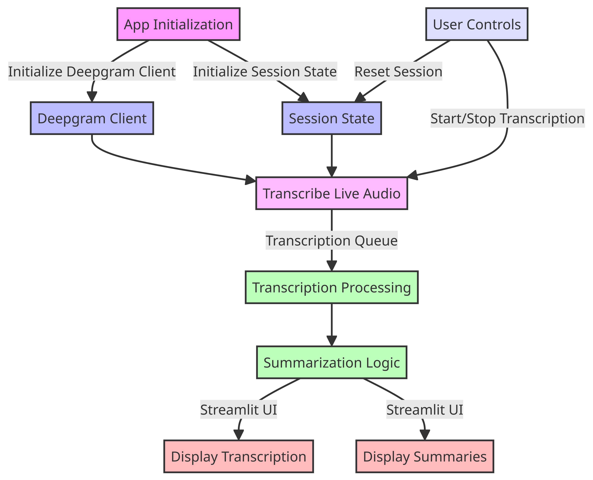

# Transcription and Summarization App

## Overview



This app provides real-time transcription and summarization of live audio. It uses the Deepgram API for transcription and OpenAI's GPT model for summarizing the transcribed text. The app is built with Python and Streamlit for a web-based interface.

## Features

- Live Audio Transcription: Transcribes live audio in real-time.
- Automatic Summarization: Summarizes transcribed text every 400 characters.
- Interactive UI: Built with Streamlit for easy use and visualization.
- Session Management: Start/stop transcription and manage session data.

## Prerequisites

- Python 3.8 or higher.
- Deepgram API key.
- OpenAI API key.

## Installation

Clone the Repository

```bash

git clone https://github.com/yourusername/transcription-app.git
cd transcription-app

```

Install Dependencies

```bash

pip install -r requirements.txt
Set Up API Keys
```

Place your Deepgram API key and OpenAI API key in a .env file or use Streamlit secrets for secure storage.

## Running the App

Start the Streamlit Server

```bash
Copy code
streamlit run app.py

```

## Using the App

Navigate to the provided local URL by Streamlit (usually http://localhost:8501).
Use the Start/Stop button to begin or end the transcription session.

View real-time transcription and generated summaries in the Streamlit interface.
Contributions
Contributions to this project are welcome. Please ensure to follow best practices for code style and commit messages.

## License

This project is licensed under the MIT License.

## Support

For support, please open an issue in the GitHub repository or contact the repository maintainer.
